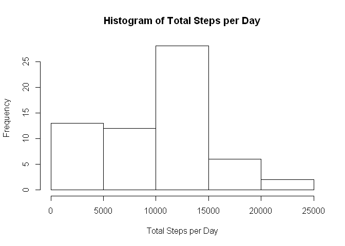
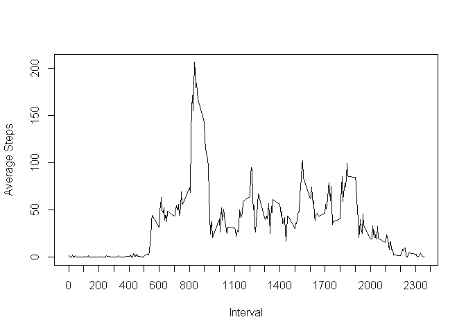
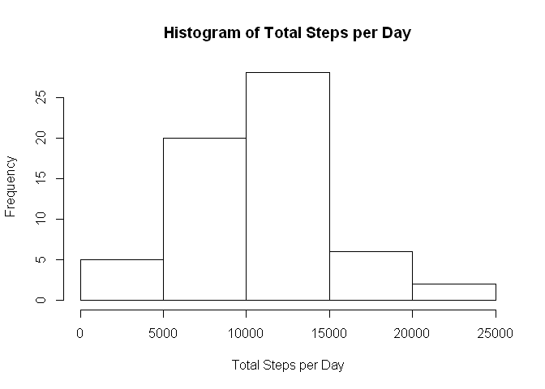

# Reproducible Research: Peer Assessment 1
##Introduction

It is now possible to collect a large amount of data about personal movement using activity monitoring devices such as a Fitbit, Nike Fuelband, or Jawbone Up. These type of devices are part of the "quantified self" movement -- a group of enthusiasts who take measurements about themselves regularly to improve their health, to find patterns in their behavior, or because they are tech geeks. But these data remain under-utilized both because the raw data are hard to obtain and there is a lack of statistical methods and software for processing and interpreting the data.

This assignment makes use of data from a personal activity monitoring device. This device collects data at 5 minute intervals through out the day. The data consists of two months of data from an anonymous individual collected during the months of October and November, 2012 and include the number of steps taken in 5 minute intervals each day.

## Loading and preprocessing the data

```r
activity<- read.csv("activity.csv", sep=",", header=TRUE, na.strings="NA")
activity$date<-as.Date(activity$date, format="%Y-%m-%d")
activity$days<-weekdays(activity$date)
activity$days<-factor(activity$days)
activity$date<-factor(activity$date)
activity$hour<-factor(floor(activity$interval/100))
activity$minute<-factor(activity$interval %% 100)
```
## What is mean total number of steps taken per day?
This calculates the total number of steps per day by taking the sum over each date of the steps, counting NAs as 0.

```r
dailytotals<-data.frame(levels(factor(activity$date)), tapply(activity$steps, activity$date, sum, na.rm=T))
names(dailytotals)<-c("Date", "Total Steps")
dailytotals
```

```
##                  Date Total Steps
## 2012-10-01 2012-10-01           0
## 2012-10-02 2012-10-02         126
## 2012-10-03 2012-10-03       11352
## 2012-10-04 2012-10-04       12116
## 2012-10-05 2012-10-05       13294
## 2012-10-06 2012-10-06       15420
## 2012-10-07 2012-10-07       11015
## 2012-10-08 2012-10-08           0
## 2012-10-09 2012-10-09       12811
## 2012-10-10 2012-10-10        9900
## 2012-10-11 2012-10-11       10304
## 2012-10-12 2012-10-12       17382
## 2012-10-13 2012-10-13       12426
## 2012-10-14 2012-10-14       15098
## 2012-10-15 2012-10-15       10139
## 2012-10-16 2012-10-16       15084
## 2012-10-17 2012-10-17       13452
## 2012-10-18 2012-10-18       10056
## 2012-10-19 2012-10-19       11829
## 2012-10-20 2012-10-20       10395
## 2012-10-21 2012-10-21        8821
## 2012-10-22 2012-10-22       13460
## 2012-10-23 2012-10-23        8918
## 2012-10-24 2012-10-24        8355
## 2012-10-25 2012-10-25        2492
## 2012-10-26 2012-10-26        6778
## 2012-10-27 2012-10-27       10119
## 2012-10-28 2012-10-28       11458
## 2012-10-29 2012-10-29        5018
## 2012-10-30 2012-10-30        9819
## 2012-10-31 2012-10-31       15414
## 2012-11-01 2012-11-01           0
## 2012-11-02 2012-11-02       10600
## 2012-11-03 2012-11-03       10571
## 2012-11-04 2012-11-04           0
## 2012-11-05 2012-11-05       10439
## 2012-11-06 2012-11-06        8334
## 2012-11-07 2012-11-07       12883
## 2012-11-08 2012-11-08        3219
## 2012-11-09 2012-11-09           0
## 2012-11-10 2012-11-10           0
## 2012-11-11 2012-11-11       12608
## 2012-11-12 2012-11-12       10765
## 2012-11-13 2012-11-13        7336
## 2012-11-14 2012-11-14           0
## 2012-11-15 2012-11-15          41
## 2012-11-16 2012-11-16        5441
## 2012-11-17 2012-11-17       14339
## 2012-11-18 2012-11-18       15110
## 2012-11-19 2012-11-19        8841
## 2012-11-20 2012-11-20        4472
## 2012-11-21 2012-11-21       12787
## 2012-11-22 2012-11-22       20427
## 2012-11-23 2012-11-23       21194
## 2012-11-24 2012-11-24       14478
## 2012-11-25 2012-11-25       11834
## 2012-11-26 2012-11-26       11162
## 2012-11-27 2012-11-27       13646
## 2012-11-28 2012-11-28       10183
## 2012-11-29 2012-11-29        7047
## 2012-11-30 2012-11-30           0
```
This shows a histogram of the total steps per day in the dataset.

```r
hist(dailytotals$"Total Steps", main="Histogram of Total Steps per Day", xlab="Total Steps per Day")
```

 

This shows the mean total steps per day in the dataset.

```r
meansteps<-summary(dailytotals$"Total Steps")[4]
meansteps
```

```
## Mean 
## 9354
```

This shows the median total steps per day in the dataset.

```r
summary(dailytotals$"Total Steps")[3]
```

```
## Median 
##  10400
```
## What is the average daily activity pattern?
Here is a graph of the average number of steps taken per five minute interval.

```r
timeaverages<-data.frame(as.numeric(levels(factor(activity$interval))), tapply(activity$steps, activity$interval, mean, na.rm=T))
names(timeaverages)<-c("Interval", "Average Steps")
par(lab=c(23,5,7))
plot(timeaverages, type="l")
```

 

The maximum activity interval is shown below.

```r
timeaverages[which(timeaverages$"Average Steps"==max(timeaverages$"Average Steps")),]
```

```
##     Interval Average Steps
## 835      835      206.1698
```
## Imputing missing values
Total number of missing values for steps by date and interval.

```r
length(which(is.na(activity$steps)))
```

```
## [1] 2304
```
Total number of missing days.

```r
activity2<-data.frame(levels(factor(activity$interval)), tapply(activity$steps, activity$interval, sum))
names(dailytotals2)<-c("Date", "Total Steps")
which(is.na(dailytotals2$"Total Steps"))
```

```
## named integer(0)
```
Because the NA values are NA for the entire days, the best way to impute the data for those days is to use the mean over each activity period from the valid data.

```r
meanperinterval<-tapply(activity$steps, activity$interval, mean, na.rm=TRUE)
activity2<-activity
activity2[which(is.na(activity2$steps)),1]<-meanperinterval
```
This shows a histogram of the total steps per day in the imputed dataset. The 8 days that were zero are now moved from the 0 to 5,000 bin to the 10,000 to 15,000 steps per day bin.

```r
dailytotals2<-data.frame(levels(factor(activity2$date)), tapply(activity2$steps, activity2$date, sum, na.rm=T))
names(dailytotals2)<-c("Date", "Total Steps")
hist(dailytotals2$"Total Steps", main="Histogram of Total Steps per Day (with imputed data)", xlab="Total Steps per Day")
```

 

This shows the mean total steps per day in the imputed dataset. This has increased because we added steps to the missing days.

```r
summary(dailytotals2$"Total Steps")[4]
```

```
##  Mean 
## 10770
```

This shows the median total steps per day in the imputed dataset. This has increased from the original.

```r
summary(dailytotals2$"Total Steps")[3]
```

```
## Median 
##  10770
```
The original number of total steps:

```r
sum(dailytotals$"Total Steps", na.rm=TRUE)
```

```
## [1] 570608
```
The number of total steps in the imputed dataset:

```r
sum(dailytotals2$"Total Steps")
```

```
## [1] 656737.5
```
As expected, the difference is the total of the 8 missing days replaced by the average activity profile.

```r
sum(dailytotals2$"Total Steps")-sum(dailytotals$"Total Steps", na.rm=TRUE)
```

```
## [1] 86129.51
```

## Are there differences in activity patterns between weekdays and weekends?
We create a factor variable called weekend on the imputed data to differentiate between the two.

```r
activity2$date<-as.Date(activity2$date)
activity2$day<-weekdays(activity2$date)
weekends<-which(activity2$day=="Saturday" | activity2$day=="Sunday")
activity2$weekend<-"weekday"
activity2[weekends,8]<-"weekend"
activity2$weekend<-factor(activity2$weekend)
```
We then graph the mean steps per interval on weekdays and weekends separately. We can see that on weekdays there is a larger spike around 9 AM and that weekend activity seems to be more evenly distributed throughout the day.

```r
library(ggplot2)
library(plyr)
intervalmeans<-ddply(activity2, .(interval, weekend), summarize, steps=mean(steps))
qplot(interval, steps, data=intervalmeans, facets=weekend~., geom=c("line"), xlab="Interval", ylab="Number of Steps")
```

 
